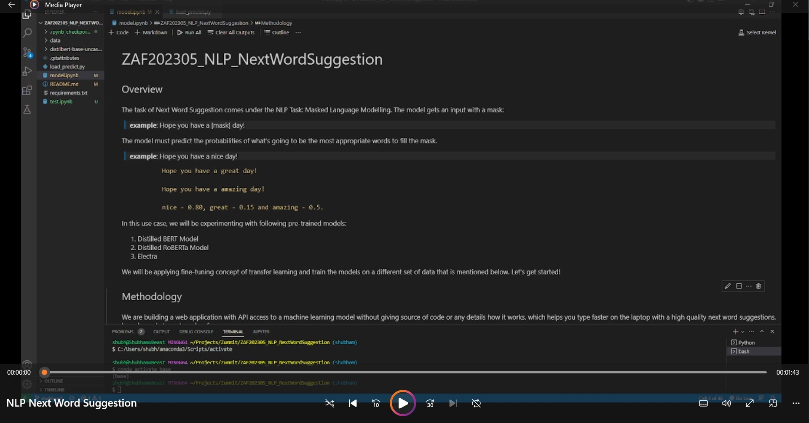

# ZAF202305 Next Word Suggestion
## Overview

We are building a web application with API access to a machine learning model without giving source of code or any details how it works, which helps you type faster on the laptop with a high quality next sword suggestions, based on what was typed so far. There are several possible scenarios:

## Methodology
The task of Next Word Suggestion comes under the NLP Task: Masked Language Modelling. The model gets an input with a mask:    

> **example**: Hope you have a \[mask] day!     

The model must predict the probabilities of what's going to be the most appropriate  words to fill the mask.     

> **example**: Hope you have a nice day!     

               Hope you have a great day!     
               
               Hope you have a amazing day!     
               
               nice - 0.80, great - 0.15 and amazing - 0.5.    

In this use case, we will be experimenting with following pre-trained models:    
1. Distilled BERT Model
2. Distilled RoBERTa Model
3. Electra    

We will be applying fine-tuning concept of transfer learning and train the models on a different set of data that is mentioned below.
Let's get started!

## AI Application
- NLP

## Business Segments
- Lifestyle & Social Media, Media & Publishing
- Business & Private Sector

## Use Case Development can be found [here](https://docs.google.com/document/d/1V070_FZStj2Sp_UYRbYDVAHzKyz9P5wBXHR2JNOzw6M/edit?usp=sharing).

## Instructions
In order to use this model follow the steps below:
1. Clone the repository using the below command and go into the directory.
```
git clone https://github.com/ybezginova2016/ZAF202305_NLP_NextWordSuggestion
cd "ZAF202305_NLP_NextWordSuggestion/"
```
2. Change the branch using the below command:
```
git checkout shubham
```
3. Install the dependencies using the below command:
```
pip install -r requirements.txt
```

4. Run the "load_predict.py" file using Python.


## Data
1. Empathetic_Dialogues - [Link](https://huggingface.co/datasets/empathetic_dialogues)

## Papers
1. BERT: Pre-training of Deep Bidirectional Transformers for Language Understanding - [Link](https://arxiv.org/abs/1810.04805)

## Demo Link
**Click below to view demo**
[](https://1drv.ms/v/s!AuQ0zVSghQNegtFDOQq2vwzjZZGJig?e=i4cgee)

## Team
- Shubham - shubhamwankar
- Jay Sanghavi - Jay-Sanghavi
- Mohd Sadiq - sadiisays
- Mayank Mangal Mourya - mayankmangalmourya
- Priyanka - priyanka011011
- Sanjeeb- sanjeebtiwary